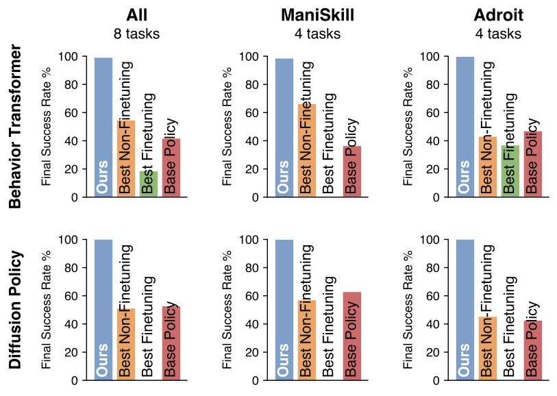

<h1>Policy Decorator</span></h1>

Official implementation of

[Policy Decorator: Model-Agnostic Online Refinement for Large Policy Model](https://arxiv.org/abs/2412.13630) by

[Xiu Yuan](https://xiuyuan0216.github.io/)\*, [Tongzhou Mu](https://cseweb.ucsd.edu/~t3mu/)\*, [Stone Tao](https://www.stoneztao.com/), [Yunhao Fang](https://seerkfang.github.io/), Mengke Zhang, [Hao Su](https://cseweb.ucsd.edu/~haosu) (UC San Diego)</br>

*Equal Contribution</br>

ICLR 2025

</br>
 
[[Webpage]](https://policydecorator.github.io/) [[Paper]](https://arxiv.org/abs/2412.13630) [[Video]](https://drive.google.com/file/d/1PwWwFhFTJSUFmEFcrzEEcy5IYHYJ4KLd/preview) [[Slides]](https://drive.google.com/file/d/1Jjffmbh4yqUMQH4fdBxm9-bZuBbiwVid/view?usp=sharing)

----


## Overview

Large policy models learned by imitation learning are often limited by the quantity, quality, and diversity of demonstrations. We introduce **Policy Decorator**, which uses a **model-agnostic** residual policy to refine large policy models during **online interactions**. By implementing controlled exploration strategies, Policy Decorator enables stable, sample-efficient online learning. 

<br/>

Our evaluation spans eight tasks across two benchmarks—ManiSkill and Adroit—and involves two state-of-the-art imitation learning models (Behavior Transformer and Diffusion Policy). The results show Policy Decorator effectively improves the offline-trained policies and preserves the smooth motion of imitation learning models, avoiding the erratic behaviors of pure RL policies.


----

## Installation

1. Install all dependencies via `mamba` or `conda` by running the following command:

```bash
mamba env create -f environment.yml
mamba activate pi-dec
```

Note: `mamba` is a drop-in replacement for `conda`. Feel free to use `conda` if you prefer it.


2. Download and link the necessary assets for ManiSkill

```bash
python -m mani_skill2.utils.download_asset partnet_mobility_faucet
python -m mani_skill2.utils.download_asset partnet_mobility_chair
```

which downloads assets to `./data`. You may move these assets to any location. Then, add the following line to your `~/.bashrc` or `~/.zshrc`:

```bash
export MS2_ASSET_DIR=<path>/<to>/<data>
```

and restart your terminal. 


----

## Run Experiments

Policy Decorator improves an offline-trained base policy via online interactions. We provide examples on how to online improve a base policy checkpoint, as well as how to train your own base policies, below.

### Online Improvement

You can skip the base policy triaining and directly use the pre-trained base policy checkpoints (Behavior Transformer and Diffusion Policy) provided by us. The base policy checkpoints can be downloaded [here](https://drive.google.com/drive/folders/1W0jwgVP9W1odt_F6vrwtYcnksdbwF1gi?usp=sharing) and should be put under `./checkpoints`. See below examples on how to improve pre-trained base policy checkpoints by Policy Decorator.

The following commands should be run under the repo root dir.

Use *Diffusion Policy* as the base policy:
```bash
# State observation

python online/pi_dec_diffusion_maniskill2.py --env-id PegInsertionSide-v2 --base-policy-ckpt checkpoints/diffusion_PegInsertionSide/checkpoints/best.pt --res-scale 0.1 --prog-explore 30_000

python online/pi_dec_diffusion_maniskill2.py --env-id TurnFaucet-v2 --base-policy-ckpt checkpoints/diffusion_TurnFaucet/checkpoints/best.pt --res-scale 0.1 --prog-explore 100_000 --total-timesteps 2_000_000

python online/pi_dec_diffusion_maniskill2.py --env-id PushChair-v2 --base-policy-ckpt checkpoints/diffusion_PushChair/checkpoints/best.pt --res-scale 0.2 --prog-explore 300_000 --gamma 0.9 --total-timesteps 2_000_000 

# Visual observation

python online/pi_dec_diffusion_maniskill2_rgbd.py --env-id TurnFaucet-v2 --base-policy-ckpt checkpoints/diffusion_rgbd_TurnFaucet/checkpoints/best.pt --res-scale 0.05 --prog-explore 30_000

python online/pi_dec_diffusion_maniskill2_rgbd.py --env-id PushChair-v2 --base-policy-ckpt checkpoints/diffusion_rgbd_PushChair/checkpoints/best.pt --res-scale 0.2 --prog-explore 100_000 --total-timesteps 5_000_000

```

Use *Behavior Transformer* as the base policy:
```bash
python online/pi_dec_bet_maniskill2.py --env-id StackCube-v0 --base-policy-ckpt checkpoints/bet_StackCube/checkpoints/best.pt --res-scale 0.03 --prog-explore 1_000_000

python online/pi_dec_bet_maniskill2.py --env-id PegInsertionSide-v2 --base-policy-ckpt checkpoints/bet_PegInsertionSide/checkpoints/best.pt --res-scale 0.3 --prog-explore 8_000_000 --policy-lr 3e-4 --q-lr 3e-4 --total-timesteps 10_000_000

python online/pi_dec_bet_maniskill2.py --env-id TurnFaucet-v2 --base-policy-ckpt checkpoints/bet_TurnFaucet/checkpoints/best.pt --res-scale 0.2 --prog-explore 500_000 --policy-lr 3e-4 --q-lr 3e-4

python online/pi_dec_bet_maniskill2.py --env-id PushChair-v2 --base-policy-ckpt checkpoints/bet_PushChair/checkpoints/best.pt --res-scale 0.2 --prog-explore 4_000_000 --total-timesteps 6_000_000
```


Note: 
- If you want to use [Weights and Biases](https://wandb.ai) (`wandb`) to track learning progress, please add `--track` to your commands.

### Offline Imitation Learning

Instead of using our pre-trained base policy checkpoints, you can also train the base policies by yourself. The demonstration datasets can be downloaded [here](https://drive.google.com/drive/folders/1nLcuqx_7hUgel3-iXDS6MgZwKIZ0r0JH?usp=sharing) and should be put under `./data`.

The following commands should be run under the repo root dir.


Train *Diffusion Policy*:
```bash
# State observation

python offline/diffusion_policy_unet_maniskill2.py --env-id PegInsertionSide-v2 --demo-path data/PegInsertionSide/trajectory.h5

python offline/diffusion_policy_unet_maniskill2.py --env-id TurnFaucet-v2 --demo-path data/TurnFaucet/trajectory.h5

python offline/diffusion_policy_unet_maniskill2.py --env-id PushChair-v2 --demo-path data/PushChair/trajectory.h5 --control-mode base_pd_joint_vel_arm_pd_joint_vel --total-iters 300_000

# Visual observation

python offline/diffusion_policy_unet_maniskill2_rgbd.py --env-id TurnFaucet-v2 --demo-path data/TurnFaucet/trajectory_rgbd_64x64.h5 --random-shift 2

python offline/diffusion_policy_unet_maniskill2_rgbd.py --env-id PushChair-v2 --demo-path data/PushChair/trajectory_rgbd_125x50.h5 --control-mode base_pd_joint_vel_arm_pd_joint_vel
```

Train *Behavior Transformer*:
```bash
python offline/bet_maniskill2.py --env-id StackCube-v0 --demo-path data/StackCube/trajectory.h5 --control-mode pd_ee_delta_pos --batch-size 4096 --lr 0.001 

python offline/bet_maniskill2.py --env-id PegInsertionSide-v2 --demo-path data/PegInsertionSide/trajectory.h5 --n-embedding 256

python offline/bet_maniskill2.py --env-id TurnFaucet-v2 --demo-path data/TurnFaucet/trajectory.h5

python offline/bet_maniskill2.py --env-id PushChair-v2 --demo-path data/PushChair/trajectory.h5 --control-mode base_pd_joint_vel_arm_pd_joint_vel --n-clusters 16 
```

----

## Citation

If you find our work useful, please consider citing our paper as follows:

```
@inproceedings{pi_dec,
  title={Policy Decorator: Model-Agnostic Online Refinement for Large Policy Model},
  author={Yuan, Xiu and Mu, Tongzhou and Tao, Stone and Fang, Yunhao and Zhang, Mengke and Su, Hao},
  booktitle={The Thirteenth International Conference on Learning Representations},
  year={2025}
}
```

----

## Acknowledgments

This codebase is built upon the following repositories: [ManiSkill Baselines](https://github.com/tongzhoumu/ManiSkill_Baselines), [CleanRL](https://github.com/vwxyzjn/cleanrl), [minGPT](https://github.com/karpathy/minGPT), [BeT](https://github.com/notmahi/bet), and [Diffusion Policy](https://github.com/real-stanford/diffusion_policy).

## License

This project is licensed under the MIT License - see the `LICENSE` file for details. Note that the repository relies on third-party code, which is subject to their respective licenses.
